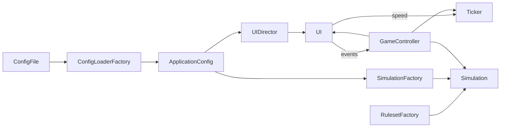

# Game of Life Architecture

`main.py` is the composition root. It selects concrete adapters and factories,
wires observers, and starts the controller. Other modules do not import it.

## Pattern Responsibilities

- **Adapter:** JSON, TOML, YAML, and XML loaders normalize external formats;
  `PygameUI` adapts Pygame input and rendering to the `UI` interface.
- **Builder:** `UIDirector` applies a typed UI recipe through `UIBuilder`.
- **Factory Method:** loader and ruleset factories select implementations by
  configuration-friendly names or file extensions.
- **Observer:** controls publish UI events; the composed UI forwards them to the
  controller and ticker through explicit subscriptions.
- **State:** running and stopped states decide transitions and tick behavior.
- **Strategy:** `Simulation` delegates generation calculation to its ruleset.

`GameController` coordinates the model, UI, and ticker. It is deliberately not
a Singleton: the composition root creates one controller per application while
tests can create independent applications without shared global state.

## Dependency Direction

The controller depends on `Simulation`, `UI`, and `TickSource`, not on Pygame,
file formats, or the system clock. `Simulation` depends only on the ruleset
strategy. Concrete loaders, Pygame, and `SystemClock` are selected at the
composition boundary, keeping domain behavior usable in headless tests.